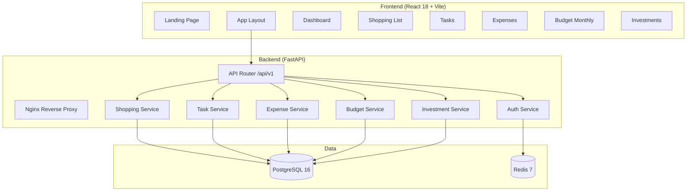

# Architektura

## Diagram komponentów



## Warstwy backendu

```
API Endpoint (router)
    ↓
Service (logika biznesowa)
    ↓
Repository (dostęp do DB)
    ↓
Model (SQLAlchemy ORM)
```

## Decyzje architektoniczne (ADR)

### ADR-001: Prosty model wydatków zamiast pełnych transakcji
**Decyzja:** `SimpleExpense` z polami `amount`, `description`, `expense_date` — bez kategorii, kont, typów.
**Powód:** Użytkownik chce prostego dziennika "kto ile wydał", nie systemu księgowego.

### ADR-002: Checklisty jako osobne modele
**Decyzja:** `ShoppingList/Item` i `TaskList/Item` jako osobne encje, nie reuse `Transaction`.
**Powód:** Checklista to inny byt niż transakcja — ma stan `is_bought`/`is_done`, nie ma kwoty.

### ADR-003: Stałe wydatki budżetowe kopiowane przy tworzeniu nowego miesiąca
**Decyzja:** `is_recurring=true` na `BudgetEntry` — przy tworzeniu budżetu na kolejny miesiąc, stałe wpisy są kopiowane.
**Powód:** Użytkownik nie chce co miesiąc wpisywać "czynsz 1500 zł" — wpisuje raz.

### ADR-004: Dokumentacja jako Mermaid w Markdown
**Decyzja:** Diagramy w Mermaid (renderowane przez GitHub), dokumentacja w repo obok kodu.
**Powód:** Diagramy "jako kod" są wersjonowane i nie wymagają zewnętrznych narzędzi.

### ADR-005: Excel export, archiwum, powiadomienia (v2.1)
**Decyzja:** Eksport do .xlsx przez openpyxl, archiwum list przez query param, powiadomienia przez istniejący model Notification.
**Powód:** Zobacz `docs/technical/adr-005-phase3.md` — szczegóły implementacji.

## Stack technologiczny

| Warstwa | Technologia |
|---------|------------|
| Frontend | React 18, TypeScript, Vite, Tailwind CSS |
| Backend | FastAPI, SQLAlchemy 2.0 (async), Pydantic |
| Baza danych | PostgreSQL 16 |
| Cache | Redis 7 |
| Autentykacja | JWT (access + refresh), Argon2 |
| Infrastruktura | Docker Compose, Nginx |