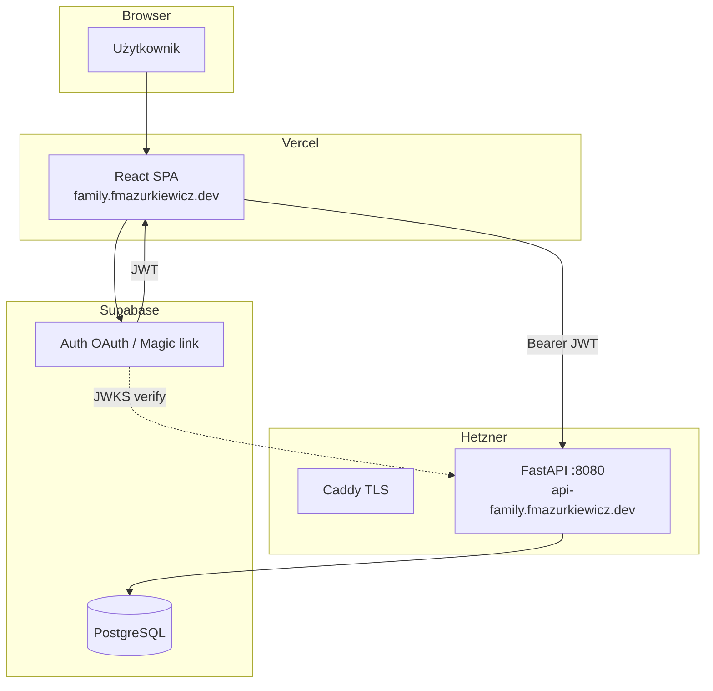
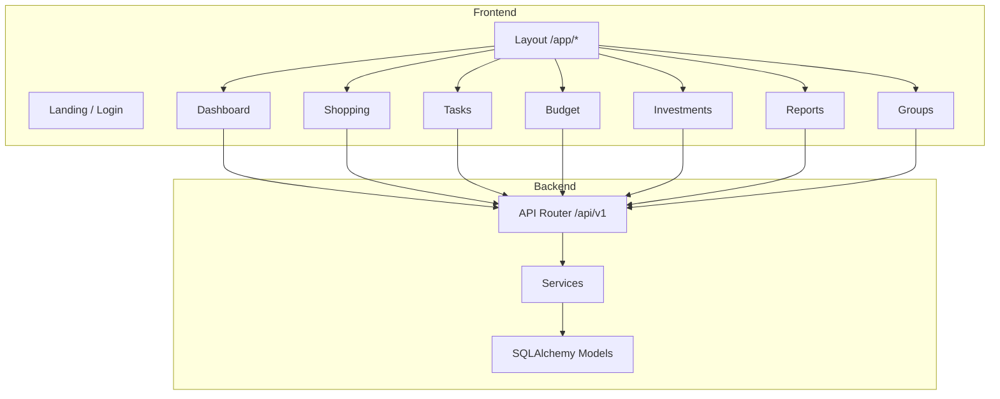

# Architektura

**Ostatnia aktualizacja:** 2026-07-30  
**Produkcja:** Vercel (FE) + Hetzner/Caddy (API) + Supabase

---

## Diagram produkcyjny



---

## Diagram modułów aplikacji



---

## Warstwy backendu

```
HTTP Request → API Endpoint (deps: JWT user)
    ↓
Service (logika biznesowa, reguły grup)
    ↓
SQLAlchemy session / queries
    ↓
PostgreSQL (Supabase)
```

Brak warstwy `repositories/` — serwisy korzystają bezpośrednio z sesji DB (uproszczenie pod skalę rodzinną).

---

## Autentykacja

| Środowisko | Mechanizm |
|------------|-----------|
| **Produkcja** | Supabase Auth → JWT → `decode_supabase_token()` → provisioning `users` |
| **Dev (opcjonalnie)** | Legacy email/hasło gdy brak `SUPABASE_*` |

Frontend:

- `AuthProvider` — hydracja sesji Supabase → Zustand (`accessToken`, `user`)
- `api/client.ts` — interceptor `Authorization: Bearer`
- Odświeżanie tokena przez `supabase.auth.refreshSession()` przy 401

---

## Frontend — struktura

```
Page → Feature Component → React Query hook → lib/api/* → axios
                              ↓
                         Zustand (auth, activeGroup)
```

Trasy chronione: `/app/*` wymaga `isAuthenticated`.

---

## Decyzje architektoniczne (ADR)

### ADR-001: Prosty budżet zamiast pełnej księgowości
**Decyzja:** `BudgetEntry` (wpływ/wydatek) zamiast kont, transakcji bankowych, reconciliation.  
**Powód:** Rodzina potrzebuje prostego miesięcznego obrazu, nie ERP.

### ADR-002: Checklisty jako osobne modele
**Decyzja:** `ShoppingList/Item`, `TaskList/Item` — osobne encje.  
**Powód:** Inny cykl życia niż wpisy budżetowe (`is_bought`, `is_done`).

### ADR-003: Stałe wydatki kopiowane co miesiąc
**Decyzja:** `is_recurring` na wpisie budżetu.  
**Powód:** Czynsz/internet wpisywany raz.

### ADR-004: Split deploy Vercel + VPS
**Decyzja:** Frontend statyczny na Vercel; API w Docker na Hetzner; baza Supabase.  
**Powód:** Tanio, prosto, auto-deploy obu warstw.

### ADR-005: Supabase Auth zamiast własnego OAuth
**Decyzja:** Magic link + Google przez Supabase; backend tylko weryfikuje JWT.  
**Powód:** Mniej kodu security-critical; szybsze wdrożenie.

### ADR-006: Brak Redis
**Decyzja:** Bez cache/session store Redis.  
**Powód:** Skala ~5 użytkowników; sesja w Supabase + JWT stateless.

---

## Stack technologiczny

| Warstwa | Technologia |
|---------|-------------|
| Frontend | React 18, TypeScript, Vite, Tailwind, React Query, Zustand |
| Backend | FastAPI, SQLAlchemy 2.0 async, Pydantic v2, Alembic |
| Baza | PostgreSQL 16 (Supabase managed) |
| Auth | Supabase Auth + PyJWT / JWKS |
| FE hosting | Vercel |
| API hosting | Docker + Caddy (Hetzner) |
| CI/CD API | GitHub Actions + SSH |

---

## Pliki kluczowe

| Plik | Rola |
|------|------|
| `frontend/src/lib/supabase.ts` | Klient Supabase |
| `frontend/src/components/auth/AuthProvider.tsx` | Sesja |
| `frontend/vercel.json` | SPA + opcjonalny proxy `/api` |
| `backend/app/api/deps.py` | `get_current_user`, admin |
| `backend/app/services/user_provisioning.py` | Mapowanie Supabase → `users` |
| `docker-compose.prod.yml` | Prod stack |
| `scripts/deploy.sh` | Deploy + migracje + health |

Szczegóły deploy: [platform-architecture.md](../deployment/platform-architecture.md)
