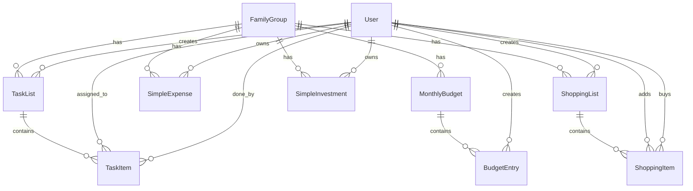

# Model danych

## Diagram ERD (nowe moduły)

## Nowe encje

### shopping_lists
| Kolumna | Typ | Opis |
|---------|-----|------|
| id | UUID PK | |
| family_group_id | UUID FK | Grupa rodzinna |
| name | VARCHAR(100) | Nazwa listy |
| created_by | UUID FK | Kto utworzył |
| created_at | TIMESTAMP | |

### shopping_items
| Kolumna | Typ | Opis |
|---------|-----|------|
| id | UUID PK | |
| list_id | UUID FK | Lista nadrzędna |
| name | VARCHAR(200) | Nazwa produktu |
| quantity | INTEGER | Ilość (domyślnie 1) |
| added_by | UUID FK | Kto dodał |
| bought_by | UUID FK (nullable) | Kto kupił |
| bought_at | TIMESTAMP (nullable) | Kiedy kupione |
| is_bought | BOOLEAN | Czy kupione |

### task_lists
| Kolumna | Typ | Opis |
|---------|-----|------|
| id | UUID PK | |
| family_group_id | UUID FK | Grupa rodzinna |
| name | VARCHAR(100) | Nazwa listy |
| created_by | UUID FK | Kto utworzył |
| created_at | TIMESTAMP | |

### task_items
| Kolumna | Typ | Opis |
|---------|-----|------|
| id | UUID PK | |
| list_id | UUID FK | Lista nadrzędna |
| title | VARCHAR(200) | Treść zadania |
| assigned_to | UUID FK (nullable) | Komu przypisane |
| done_by | UUID FK (nullable) | Kto wykonał |
| done_at | TIMESTAMP (nullable) | Kiedy wykonane |
| is_done | BOOLEAN | Czy wykonane |
| due_date | DATE (nullable) | Termin |
| created_at | TIMESTAMP | |

### simple_expenses
| Kolumna | Typ | Opis |
|---------|-----|------|
| id | UUID PK | |
| family_group_id | UUID FK | Grupa rodzinna |
| user_id | UUID FK | Kto wydał |
| amount | NUMERIC(12,2) | Kwota |
| description | VARCHAR(500) | Na co |
| expense_date | DATE | Kiedy |
| created_at | TIMESTAMP | |

### monthly_budgets
| Kolumna | Typ | Opis |
|---------|-----|------|
| id | UUID PK | |
| family_group_id | UUID FK | Grupa rodzinna |
| year | INTEGER | Rok |
| month | INTEGER | Miesiąc (1-12) |
| created_at | TIMESTAMP | |

### budget_entries
| Kolumna | Typ | Opis |
|---------|-----|------|
| id | UUID PK | |
| budget_id | UUID FK | Budżet nadrzędny |
| type | ENUM(income,expense) | Typ wpisu |
| name | VARCHAR(200) | Nazwa |
| amount | NUMERIC(12,2) | Kwota |
| is_recurring | BOOLEAN | Czy stały |
| created_by | UUID FK | Kto dodał |

### simple_investments
| Kolumna | Typ | Opis |
|---------|-----|------|
| id | UUID PK | |
| family_group_id | UUID FK | Grupa rodzinna |
| user_id | UUID FK | Właściciel |
| name | VARCHAR(200) | Nazwa |
| investment_type | ENUM(deposit,bonds,stocks,other) | Typ |
| principal_amount | NUMERIC(12,2) | Kapitał początkowy |
| interest_rate | NUMERIC(5,2) | Oprocentowanie % |
| interest_period | ENUM(monthly,quarterly,yearly) | Skala oprocentowania |
| start_date | DATE | Data początkowa |
| duration_value | INTEGER | Długość |
| duration_unit | ENUM(months,quarters,years) | Jednostka |
| end_date | DATE | Obliczona data końca |
| projected_profit | NUMERIC(12,2) | Prognozowany zysk |
| projected_total | NUMERIC(12,2) | Kapitał końcowy |
| notes | TEXT (nullable) | Notatki |

## ADDED — users.is_approved (2026-09-07)

`users` already has `is_active`, `is_locked`, `is_app_admin`. Approval is a **separate** boolean.

| Kolumna | Typ | Opis |
|---------|-----|------|
| is_approved | BOOLEAN | `false` for new signups; existing rows grandfathered `true`. Allowlist `ADMIN_EMAIL` auto-approved on **insert only**. Not a lock/inactive flag. |